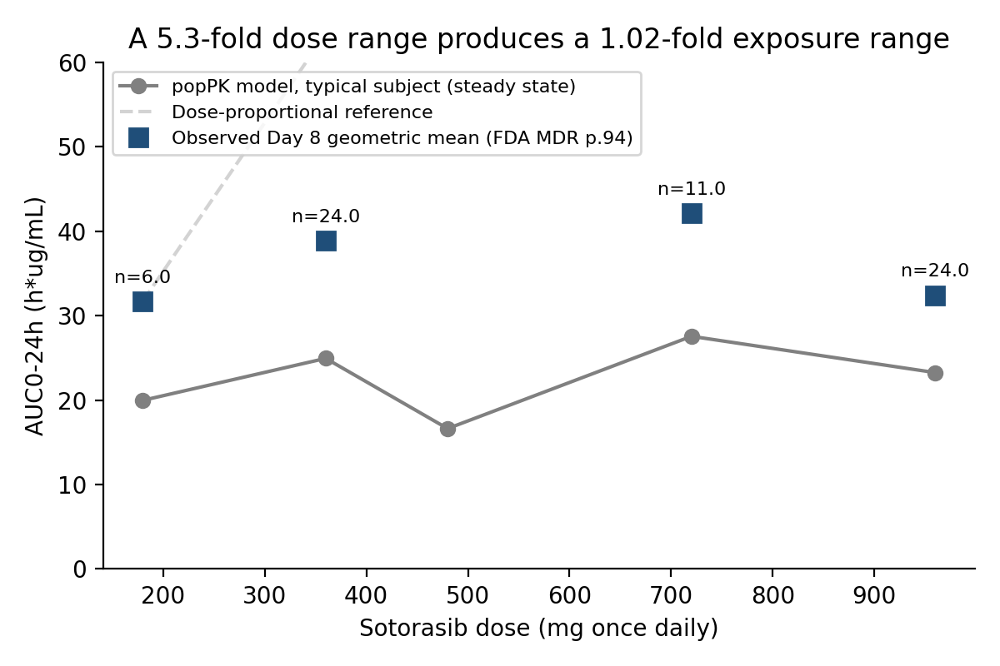
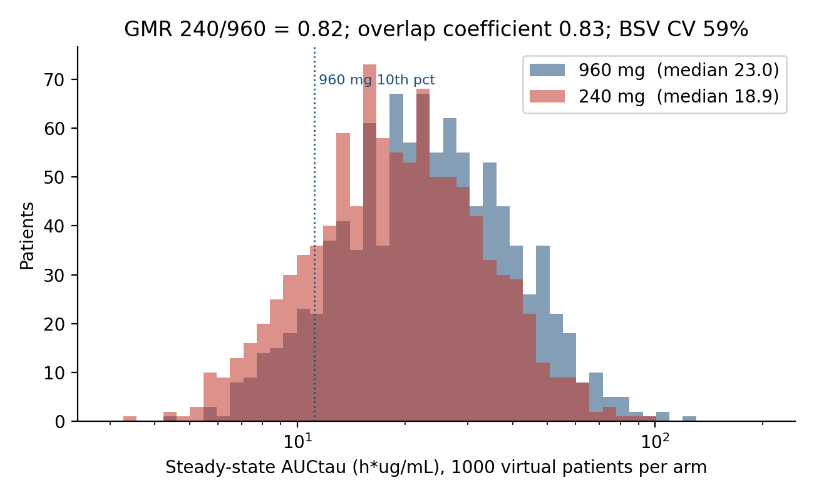
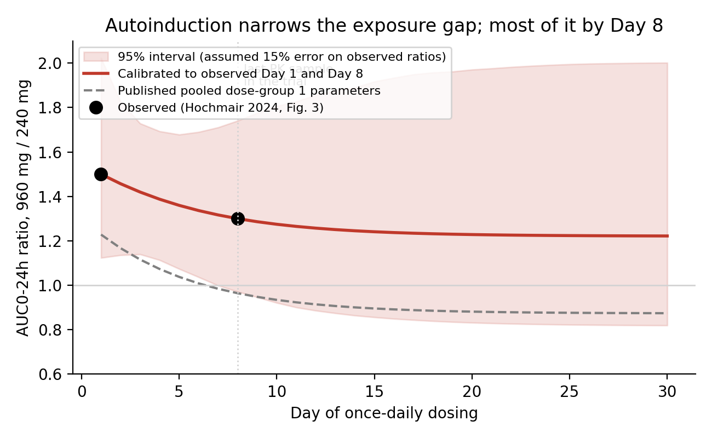
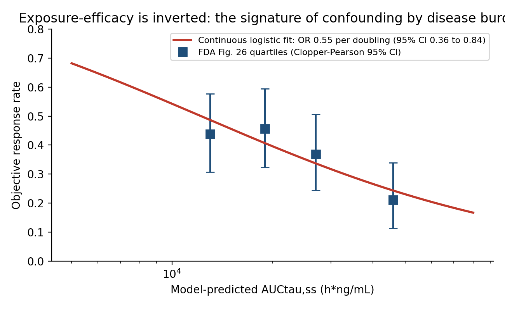
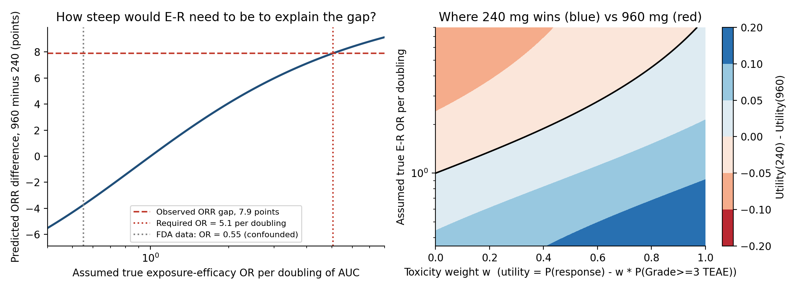

# Could the evidence ever have answered the sotorasib dose question?
### A quantitative reproduction and extension of the Project Optimus case study (LUMAKRAS, NDA 214665)

**Status:** core analysis complete (September 2026). Write-up in progress.

## The question

Sotorasib was approved at 960 mg once daily. FDA stated in its review that it did not consider that dose optimized, and required a randomized comparison against 240 mg. The trial returned ORR 32.7% vs 24.8%, was not powered for hypothesis testing, and the label did not change. Popat and Ratain (EJC 2024) argue 240 mg is the correct dose; FDA leadership (Singh, Vellanki, Pazdur, JCO 2025) argue the retrofit was the problem, not the answer.

This project does not adjudicate that dispute. It asks a narrower, answerable question: **given the pharmacokinetics, could the exposure-response evidence and the dose-comparison trial, as they existed, have resolved which dose is better? If not, what would it have taken?**

## Extensions evaluated in this repository

Selected published results are reproduced from public data. Relative to the cited FDA/Amgen analyses and Popat/Ratain commentary, this repository evaluates four extensions:

| # | Contribution | Result |
|---|---|---|
| 1 | **Exposure overlap at 240 vs 960 mg**, from the published popPK model, implemented and checked against ten published covariate-effect contrasts, with between-subject variability and parameter uncertainty | GMR 240/960 = **0.82** (95% sensitivity interval **0.50 to 1.22**, propagated from independently sampled Day 1/Day 8 calibration targets with assumed log-scale SD 0.15, approximately 15% relative uncertainty). This is not a conventional confidence interval. Overlap coefficient **0.83**. A 4-fold dose change shifts exposure 18% against a 59% between-subject CV. |
| 2 | **The steady-state projection.** The trial sampled PK only to Day 8; steady state is ~Day 22. Popat/Ratain say this matters but do not quantify it. | Calibrated to the observed Day 1 (1.5) and Day 8 (1.3) ratios, the model-projected steady-state 960/240 exposure ratio under the calibrated 240 mg F1 scenario is approximately **1.22**. Most of the narrowing had happened by Day 8. |
| 3 | **Power and sample size, reproduced independently** | Approximately **24% post hoc power** treating the observed 7.9-percentage-point ORR difference (34/104 vs 26/105) as the true effect. **658 total participants** for 80% power to detect **35% vs 25% ORR**, with equal allocation and two-sided alpha 0.05. This is consistent with the cited >600 and >500 estimates, without reconstructing their exact assumptions. The unstratified 90% risk-difference CI rounds to the published limits. |
| 4 | **Tipping-point analysis** | To produce the observed 8-point ORR gap from an 18% exposure difference, the true exposure-efficacy relationship would need **OR 5.1 per doubling of exposure**. FDA's own quartile data give OR 0.55 in the opposite direction. Explaining the observed ORR difference through exposure alone would require a positive relationship substantially steeper, and opposite in direction, to the estimate from FDA's published quartile data. Binned, unadjusted data cannot establish causality. |

The repository also examines a treatment-management feature of the trial:

**5. Dose reductions were permitted in the 960 mg arm only** (Hochmair 2024, Methods 2.1). The trial compared an adaptive strategy ("start at 960, titrate down") against a fixed dose ("240 mg with interruption or discontinuation"). Hepatotoxicity-driven discontinuation was 10.6% at 240 mg vs 5.8% at 960 mg. The asymmetric dose-modification rules complicate comparison of delivered dose intensity, treatment persistence, and tolerability. These observations do not establish that the rules caused the discontinuation difference or favored either arm for efficacy.

## Headline figures

| | |
|---|---|
|  |  |
|  |  |



## The conclusion

The public exposure-response summaries and randomized comparison leave substantial uncertainty about dose selection. Under the stated assumptions, the simulations show extensive exposure overlap and limited power for plausible ORR differences. The observed efficacy difference, baseline imbalance, and asymmetric dose-modification rules require cautious interpretation; these analyses do not establish dose equivalence or rule out a pharmacological effect. The results illustrate the value of prospectively planned dose comparisons, consistent with Project Optimus.

## Model verification

The popPK implementation (two-compartment, three transit absorption compartments, time-dependent CL and F via CYP3A4 autoinduction, six covariates, published 3x3 omega matrix) reproduces all ten published covariate exposure ratios from the Amgen forest plot within 2.5% (nineteen of twenty numbers within 1.1%). See `results/validation_covariate_ratios.csv`. Absolute-scale agreement is less close: typical-subject Day 8 AUC is 29,749 versus 35,300 h·ng/mL in the published population summary. These are secondary checks because the original covariate distribution is not fully reconstructable; agreement on relative contrasts is not global model validation.

During implementation, two published unit labels were found to be wrong. The albumin coefficient is labeled (L/hr)/(g/dL) in both the FDA review and the AAPS paper; only an interpretation in g/L reproduces the published forest-plot ratio of 1.414. The FDA table column headed "%RSE" on the IIV rows actually contains %CV. Both are documented in `data/PARAMETER_RESOLUTION.md`.

## Repository

```
data/       Every number, with page-level citation (100 rows, 0 unverified)
src/        model.py  validate.py  calibrate_240.py  simulate_population.py  decision_analysis.py  figures.py
R/          00_install.R  01_model_validate.R  02c_simulate_and_recover_diag.R (reported nlmixr2 SAEM run)  03_population_240_vs_960.R
results/    Machine-readable outputs of every analysis
figures/    Six figures
docs/       ANALYSIS_NOTES.md (scope, assumptions, design interpretation)
```

Install Python dependencies, then run from the repository root:

```bash
pip install -r requirements.txt
python3 src/validate.py
python3 src/calibrate_240.py
python3 src/simulate_population.py
python3 src/decision_analysis.py
python3 src/figures.py
```

The primary analysis was implemented in Python. An independent R implementation using rxode2 and nlmixr2 was subsequently executed in Posit Cloud. The Python pipeline produced the headline simulation results. The reported R estimation results come from the reduced-scale diagonal-omega `02c` run (60 synthetic subjects, 100 burn-in and 100 estimation iterations). The covariance/SE step did not complete; the saved recovery table contains point estimates from the printed iteration log. See `R/README.md` for run order and limitations.

## Limitations

- **Simulation from published parameters, not estimation from patient-level data.** The parameter table is Amgen's; patient-level data are not public. Estimation is demonstrated by simulate-and-recover in nlmixr2 (`R/02c_simulate_and_recover_diag.R`), which shows the population-estimation workflow without claiming a fit to real trial data.
- **240 mg was never an assigned dose in the popPK dataset.** The published dose-group pooling misfits it (predicts 240/960 = 1.15; observed 0.77). The headline uses F1 values calibrated to two observed ratios: the calibration is exactly identified, so goodness-of-fit cannot be assessed. The sensitivity interval uses independent lognormal perturbations with log-scale SD 0.15 on each observed ratio. This assumed uncertainty is not an empirically estimated standard error. Other model parameters remain fixed.
- **Exposure-response reanalysis is on binned data.** Patient-level data are not public, so covariate adjustment was not possible. The continuous logistic fit puts efficacy on the same functional footing as FDA's safety analysis; it does not remove the confounding.
- **Albumin distribution SD is assumed** (5 g/L); the source reports median and range only.
- **The utility function is illustrative.** The tipping-point surface shows where conclusions flip; it does not assert a weight.

## Primary sources

1. FDA. NDA 214665 Multi-Discipline Review, LUMAKRAS. Reference ID 4803204.
2. Nagase M et al. AAPS J 2025;27:26. PMID 39806205.
3. Hochmair MJ et al. Eur J Cancer 2024;208:114204.
4. Popat S, Ratain MJ. Eur J Cancer 2024;212:115044.
5. Singh H, Vellanki PJ, Pazdur R. J Clin Oncol 2025;43:248-250.
