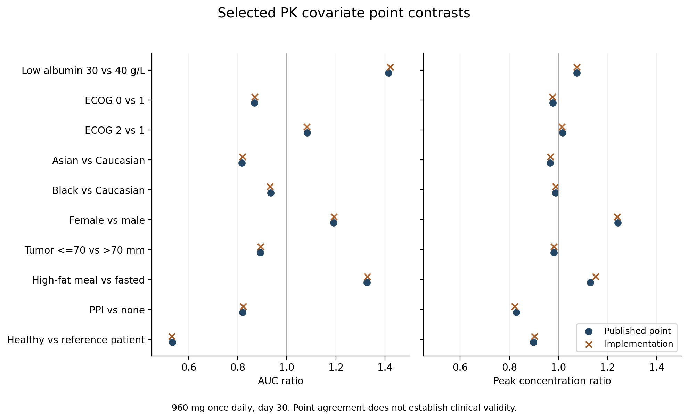
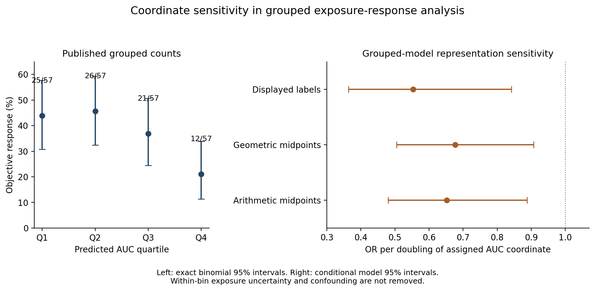

# Sotorasib dose evidence: reproduction and sensitivity analysis

This repository uses public aggregate evidence to examine what selected pharmacokinetic and statistical calculations can support about a dose-development question. The current analysis is deliberately narrow: published-model point checks, grouped exposure-coordinate sensitivity, and one explicitly hypothetical response-rate planning scenario. It does not identify an optimal sotorasib dose, establish dose equivalence, fit individual trial data, or reproduce the sponsor's original model development.

## Current supported results

| Analysis | Result | Meaning |
|---|---|---|
| Published PK covariate checks | 10/10 contrasts (20 point ratios) pass the retained 5% numerical comparison threshold; largest difference 1.901% | Limited agreement with selected published point summaries, not clinical model validation. |
| Grouped exposure-coordinate sensitivity | OR per coordinate doubling: 0.553 using displayed labels; 0.677 using geometric range midpoints; 0.653 using arithmetic range midpoints | The fitted magnitude depends on how four bins are represented. Neither coordinate choice resolves confounding or recovers patient exposures. |
| Hypothetical ORR design | 329 per arm, 658 total | 35% versus 25% response, equal allocation, two-sided alpha 0.05 and 80% power under the stated normal approximation. Not the sponsor's plan or a uniquely recommended design. |

Conditional 95% intervals for the three grouped fits are 0.364–0.842, 0.505–0.907 and 0.480–0.887. They omit uncertainty in coordinate choice, within-bin exposures and confounding. The source Figure 26 totals 228 patients, whereas nearby methods refer to 248; the difference remains unresolved.

## Reproduce the retained analysis

Use Python with the dependencies in `requirements.txt`. The exact tested environment is recorded in `reports/execution_report.json`; `requirements-tested.txt` lists the tested package versions. An isolated environment is recommended when installing dependencies.

```bash
python -m pip install -r requirements-tested.txt
python src/run_all.py
```

The runner executes the focused tests, PK point checks, numerical checks, grouped-coordinate sensitivity, hypothetical design scenario and figure generation. The active pipeline is deterministic and does not use random draws. The original baseline was independently rerun before correction; the historical runner and its random seeds are archived rather than presented as supported commands.

Individual supported commands, in order:

```bash
python -m unittest discover -s tests -v
python src/validate.py
python src/numerical_checks.py
python src/grouped_exposure_response.py
python src/design_scenario.py
python src/figures.py
```

Run these from the repository root. `src/run_all.py` creates output directories and records command exit status, environment, code/input hashes and omitted checks.

## Current figures



**Figure 1.** Implementation and published point contrasts from Nagase Figure 3, at 960 mg once daily. The implementation uses day 30, a 0.03125-hour sample grid, and LSODA tolerances documented in the numerical report. Only point contrasts are compared; published uncertainty bands are not reproduced. Covariate definitions follow the source's labels. Agreement is not clinical validation.



**Figure 2.** Left: FDA Figure 26 response counts in four predicted-AUC quartiles, with Clopper–Pearson exact binomial 95% intervals calculated here from the source counts. Right: conditional Wald 95% intervals from three grouped-binomial logistic fits. Exposure ranges and displayed coordinates are distinct source fields; alternative midpoints are assumptions, not inferred individual exposures. AUC is in h·ng/mL. The association is unadjusted and does not establish a causal exposure effect. The figure is a newly generated display of the retained aggregate data, not a copy of the FDA image.

## Corrections and exclusions

The active interval calculation now includes exact endpoints, interpolates requested boundaries when needed, forbids extrapolation, and explicitly treats central concentration as continuous at an oral dose. The terminal metric is called `C_tau`, avoiding confusion with the interval minimum. A source-linked test protects the corrected FDA quartile boundaries. Numerical refinement and an analytical steady-state mass-balance identity supplement the implementation checks.

The previous two-target 240-mg calibration and overlap projections are on hold: exact day-specific targets, averaging conventions and denominators have not been verified from the final trial report. Fitting two parameters to two targets is calibration, not independent validation. With shared virtual subjects and clearance, the steady-state AUC ratio reduces algebraically to `(240 × F240) / (960 × F960)`; simulation does not independently corroborate that ratio.

The previous toxicity/utility and efficacy-threshold results are excluded. The toxicity curve described matching both arm means but actually predicted 58.42% and 49.00% instead of its stated 61.5% and 49.0% targets. Merely retuning a curve would not justify a causal exposure-toxicity model or a benefit-risk utility. Post hoc observed-effect power is not active evidence. The incomplete R estimation run is historical only.

All 45 original tracked files are preserved exactly under [`archive/baseline-043a805`](archive/baseline-043a805), with a SHA-256 manifest. Archived README statements and figures are superseded. The active runner never executes the archive. See the [correction log](docs/CORRECTION_LOG.md), [methods and limitations](docs/ANALYSIS_NOTES.md), [source notes](data/SOURCE_NOTES.md) and [execution report](docs/EXECUTION_REPORT.md).

## Provenance and assistance

Sohum Mallik reports conducting the original project with Claude assistance in writing Python and R code and is the sole author. Subsequent source auditing, code correction, testing, regenerated figures and documentation involved Codex assistance. This record does not imply unassisted authorship, independent human expert review or institutional endorsement. No individual clinical-trial records were used. No full-text journal PDFs are distributed here.

## Sources

- [Nagase et al., AAPS Journal 2025;27:26](https://doi.org/10.1208/s12248-024-01013-6): Tables I–II and Figures 1 and 3.
- [FDA NDA 214665 multidisciplinary review (2021)](https://www.accessdata.fda.gov/drugsatfda_docs/nda/2021/214665Orig1s000MultidisciplineR.pdf): Figure 26, PDF page 248.
- [Hochmair et al., European Journal of Cancer 2024;208:114204](https://doi.org/10.1016/j.ejca.2024.114204): final abstract available; full report and supplement not verified for the historical calibration inputs.
- [Aung et al., JCO Oncology Practice, June 2026](https://doi.org/10.1200/OP-25-01315): subsequent synthesis relevant to context. No claim that the dose question is novel is made.

Evidence cutoff: September 26, 2026. A successful run establishes the recorded computational checks, not clinical validity or readiness for public manuscript submission.
